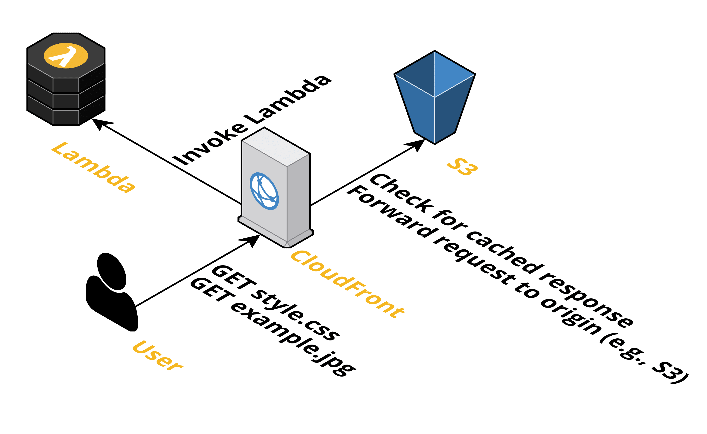
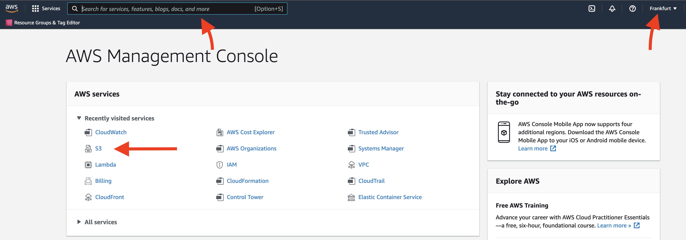
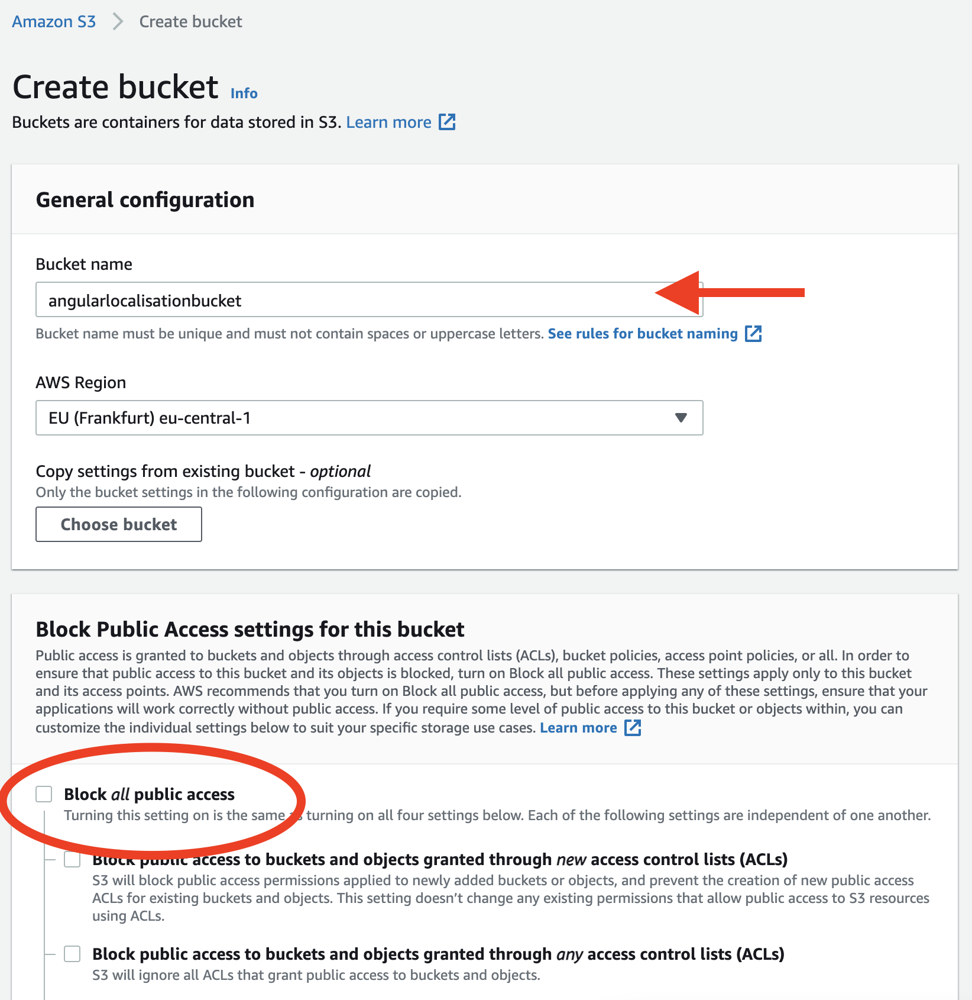
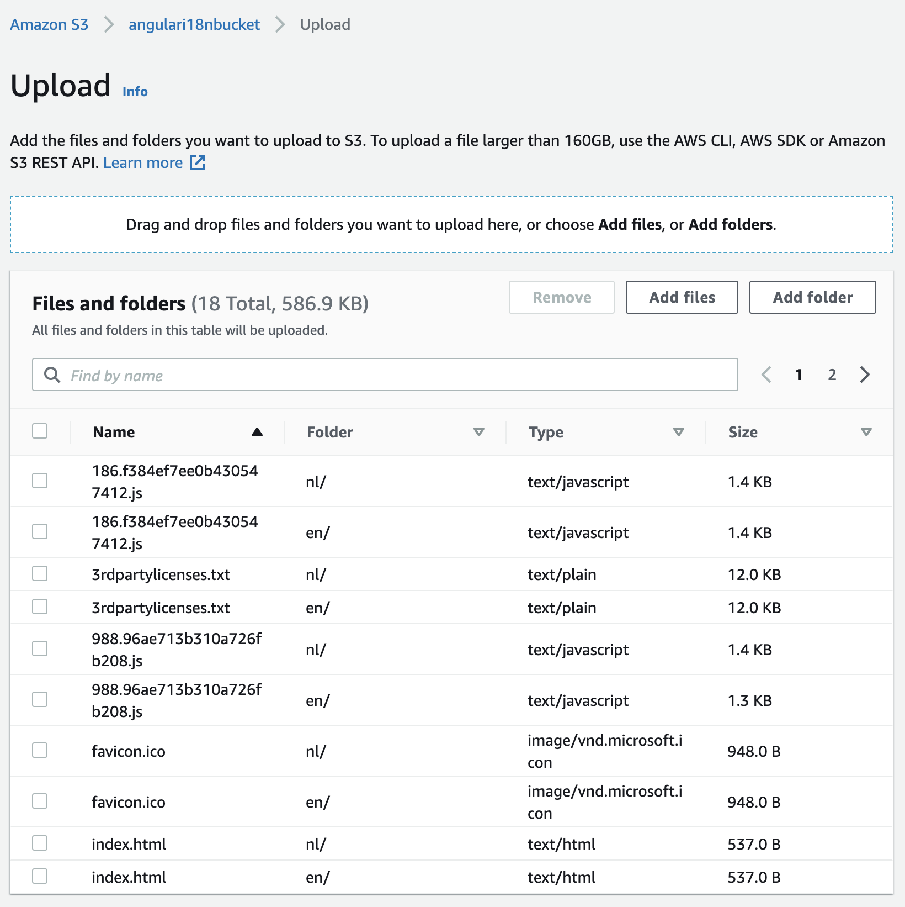
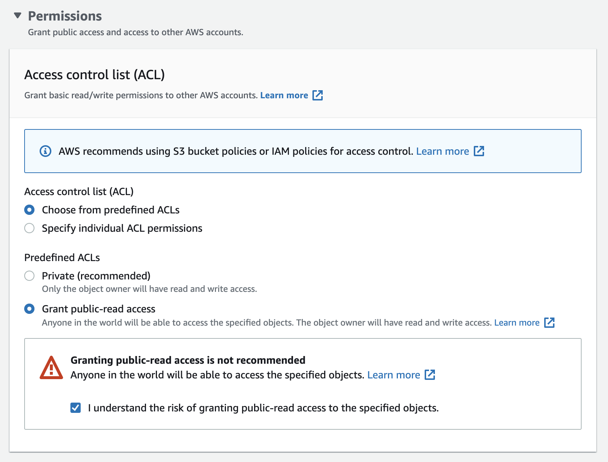
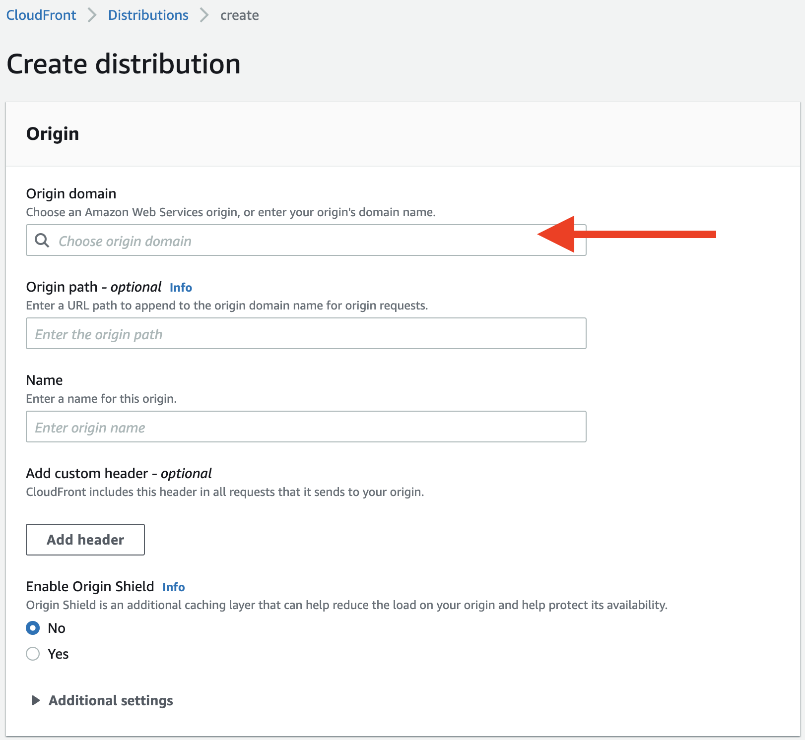
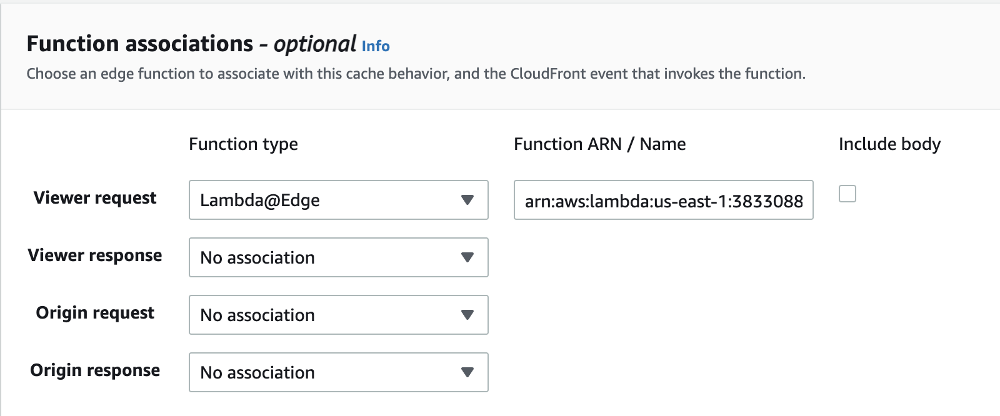
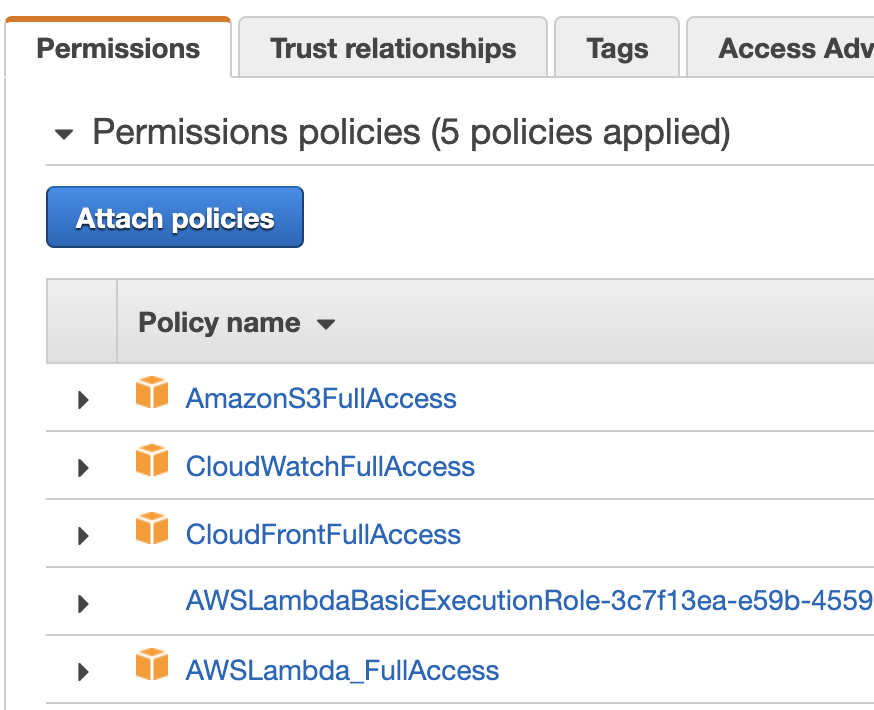
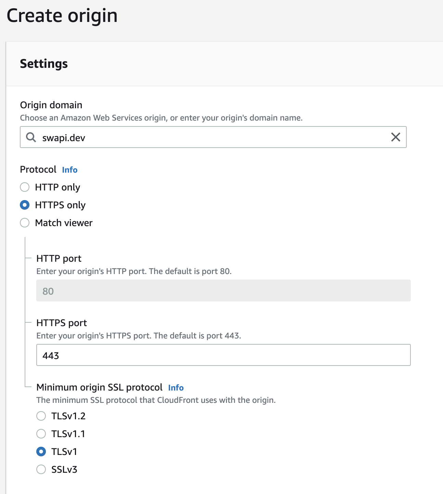
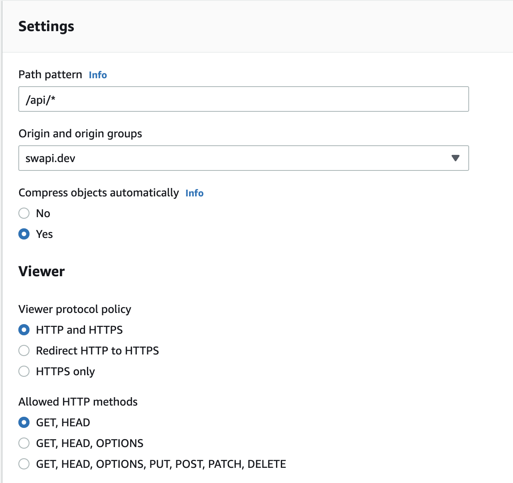

# Setup a multi-locale Angular app in AWS

This repository demonstrates how we can deploy a multi-language Angular app to AWS using services like S3, CloudFront and LambdaEdge functions.

## Prerequisites

This PoC uses some widely known AWS offerings and hence requires an AWS account. If you don't have one, feel free to [create a free-tier account](https://aws.amazon.com/free/?trk=ps_a134p0000078PqpAAE&trkCampaign=acq_paid_search_brand&sc_channel=ps&sc_campaign=acquisition_BENELUX&sc_publisher=google&sc_category=core-main&sc_country=BENELUX&sc_geo=EMEA&sc_outcome=acq&sc_detail=amazon%20web%20services&sc_content=Brand%20Amazon%20Web%20Services_p&sc_matchtype=p&sc_segment=508642239721&sc_medium=ACQ-P|PS-GO|Brand|Desktop|SU|Core-Main|Core|BENELUX|EN|Text|xx|PH&s_kwcid=AL!4422!3!508642239721!p!!g!!amazon%20web%20services&ef_id=EAIaIQobChMI9vXfxOO79AIVhNV3Ch3zWw1bEAAYASAAEgJo7PD_BwE:G:s&s_kwcid=AL!4422!3!508642239721!p!!g!!amazon%20web%20services&all-free-tier.sort-by=item.additionalFields.SortRank&all-free-tier.sort-order=asc&awsf.Free%20Tier%20Types=*all&awsf.Free%20Tier%20Categories=*all) with them for 12 months.

## Setup project for i18n

Following instructions provided by [Angular docs](https://angular.io/guide/i18n-common-overview), the app is prepared for multiple languages, `en` and `nl`. By default, Angular uses `en-US` as source locale hence final build of the project also generates a `en-US` distribution package. However, only `en` and `nl` are used for demonstration purposes.

For the sake of this PoC only two small strings are targeted for translation and can be identified by custom keys `planetDetailsHeading` and `listOfPlanets`. The translation files can be found at `src/locale/`.

Standalone server is configured to only work with `en`. Follow steps documented [here](https://angular.io/guide/i18n-common-merge#apply-specific-build-options-for-just-one-locale) to setup dev server for multiple locales.

## Builds per locale

Following is how the Angular CLI creates the distribution package for a multi-locale app. Each language gets its own set of HTML, CSS & JS files to be deployed separately.

```
- dist
  - i18n-s3
    - en
      - index.html
      - favicon.ico
      - main.5f84b2e1a0ac5bcdcd0e.js
      - ....
    - nl
      - index.html
      - favicon.ico
      - main.5f84b2e1a0ac5bcdcd0e.js
      - ....
    - en-US
      - index.html
      - favicon.ico
      - main.5f84b2e1a0ac5bcdcd0e.js
      - ....
```

## Deploy app on a web server

Angular docs talk about deploying a multiple locales app only on a web server such as Nginx or Apache. For more information refer [here](https://angular.io/guide/i18n-common-deploy).

Since a web server is capable to handle incoming requests and prepare a response based on some logic, it is easier to setup the configuration there to serve different languages.

For example, following logic inside Nginx would let it serve different Angular application based on the URL

```
location ~ ^/(en|nl) {
    try_files $uri /$1/index.html?$args;
}
```

## Deploy app in S3 using CloudFront

### What is S3?

[S3](https://aws.amazon.com/s3/) is a simple object storage service offering by AWS. It can hold any kind of data in form of an object and has virtually unlimited storage.

### What is CloudFront?

[CloudFront](https://aws.amazon.com/cloudfront/) is AWS's content delivery network service built for high performance, security and developer convenience. A static website served from S3 usually uses a CDN in front for faster delivery(low latency) of content especially if the users are spread across multiple geographic locations.

### What's the problem?

Deploying and serving a multi language app from a web server is easier than serving it from S3 & CloudFront. That is because neither of these services are capable of executing a piece of function to determine which locale needs to be served.

### LambdaEdge to the rescue?

Although CloudFront itself is not designed to invoke functions to customise content, it can work with [LambdaEdge functions](https://aws.amazon.com/lambda/edge/) to achieve the desired behaviour. Lambda@Edge is an extension of AWS Lambda, a compute service that lets you execute functions that customize the content that CloudFront delivers.

Once a request is received by CloudFront, a LambdaEdge function can be executed on different events. Such as:

1. When CloudFront receives a request from a viewer (viewer request)
2. Before CloudFront forwards a request to the origin (origin request)
3. When CloudFront receives a response from the origin (origin response)
4. Before CloudFront returns the response to the viewer (viewer response)

Below is an easy description on how CloudFront, LambdaEdge and S3 interact with each other.



### Steps

Prepare Angular builds using Angular CLI

```bash
npm run build
```

Create a S3 bucket where we will store our Angular application assets. From AWS home page, choose S3 service either from the Search bar on top or Recently visited services. Make sure you are on the region of your choice. I've picked `Frankfurt` for this PoC.



Upon landing on S3 dashboard, click on `Create bucket` to create a new bucket. Enter the bucket name(which must be unique globally ie there shouldn't be any other bucket in the world with that name. AWS will give you an error otherwise). For the sake of this PoC, we also enable all public access to the bucket but this is not mandatory. Ideally, we should only enable our CloudFront to be able to access bucket through Bucket Access Policies.



Once the bucket is successfully created, click on `Upload` button which will allow you to upload the individual localised app directories. Make sure that you also grant public access permissions to individual items uploaded and not just rely on bucket level access granted above.




Congratulations on creating your S3 bucket which now is ready to serve the Angular app.

Let's create a CloudFront distribution and connect it to the S3 bucket.

Type CloudFront on the Search Bar at top and go to its dashboard. Click `Create distribution`. Choose S3 bucket created earlier in `Origin domain`. The input field should give you a suggestion if you don't remember the bucket path. Don't change anything else yet in the configuration. Scroll down and click `Create distribution`.



Our CloudFront CDN is ready now to deliver content orignating from S3 bucket. If our application was a single locale application, our work ends here and we need not do anything else. But because this app is a multi-language app, let's move further.

**IMPORTANT: LambdaEdge is only available in US-East-1 region at this moment. Hence, the function created below should be created in that region and not anywhere else.**

Go to Search Bar again and navigate to Lambda functions. Click `Create function` and fill in the details. Pick a function name and leave rest of the configurationas as it is. Add the following code to the function which will be executed whenever this function is triggered.

The logic below to handle locale negotiation is a very basic one. It can be further enhanced by also reading into request headers or cookies to determine the locale to be delivered.

```javascript
'use strict';

const path = require('path')

exports.handler = (evt, ctx, cb) => {
  const { request } = evt.Records[0].cf;

  if (!path.extname(request.uri)) {
      if (request.uri.startsWith('/nl')) {
        request.uri = '/nl/index.html';
      } else {
        request.uri = '/en/index.html';
      }
  }
  
  cb(null, request);
}
```

Find more information about each argument of the handler function here:
1. `evt` - https://docs.aws.amazon.com/AmazonCloudFront/latest/DeveloperGuide/lambda-event-structure.html
2. `ctx` - https://docs.aws.amazon.com/lambda/latest/dg/nodejs-context.html
3. `cb` - https://docs.aws.amazon.com/AmazonCloudFront/latest/DeveloperGuide/lambda-examples.html

Deploy the code and publish it. Remember the `Function ARN` along with the version number published.

Go back to the CloudFront distribution, Behaviors tab and Edit the Default behavior. Scroll to the bottom of the page to `Function associations`. At `Viewer request`, select `Lambda@Edge` as the function type and enter above created Function ARN.



You will likely get an error while saving changes. This is because the service role for Lambda Function doesn't yet have permissions to be executed from CloudFront. Using the top search bar again, navigate to IAM and go to roles.

Identify the role which requires the desired permissions and go to details.

Add the following permission policies to that role.



In addition to this, navigate to `Trust relationships` and update it with below.

```json
{
  "Version": "2012-10-17",
  "Statement": [
    {
      "Effect": "Allow",
      "Principal": {
        "Service": [
          "s3.amazonaws.com",
          "edgelambda.amazonaws.com",
          "events.amazonaws.com",
          "lambda.amazonaws.com"
        ]
      },
      "Action": "sts:AssumeRole"
    }
  ]
}
```

Go back to CloudFront and save the configuration.

Our Angular app is now successfully deployed and ready to be served. However, there is one last item which remains i.e configuring API root.

There are potentially multiple ways by which this can be done best but for sake of this PoC we make use of CloudFront distribution's distribution based on request path.

We use Swapi dev free API for this application and need that all requests with `/api` in the path should be redirected to https://swapi.dev/ instead of our S3.

Go back to CloudFront distribution and create a new origin. Leave all configurations as it is.



Navigate to Behaviors tab and create a new behavior. Add the path pattern as below and select the Swapi Dev origin to redirect to.



Congratulations!!!

You have successfully setup your multi-locale application using S3, CloudFront and LambdaEdge services.

### Demo

Find a demo of this app at https://d3ilgvmta2e8p9.cloudfront.net/ and can play with `en` and `nl` languages.

## References:

1. https://blog.cloudcraft.co/programming-your-cdn/
2. https://docs.aws.amazon.com/AmazonCloudFront/latest/DeveloperGuide/lambda-at-the-edge.html